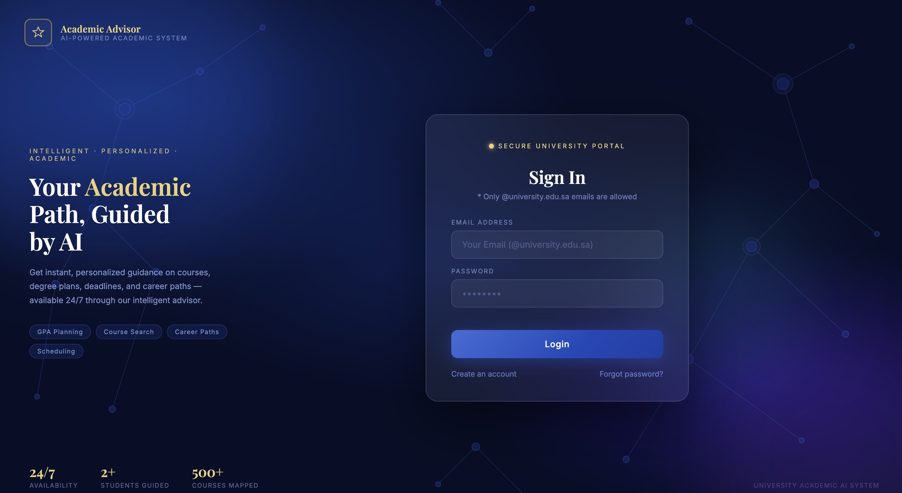
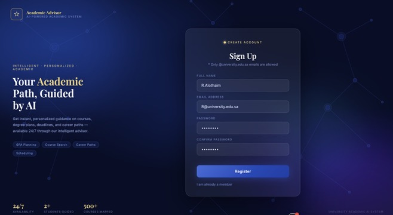
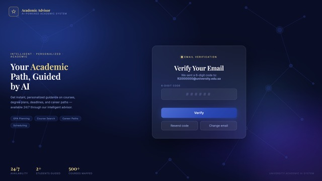
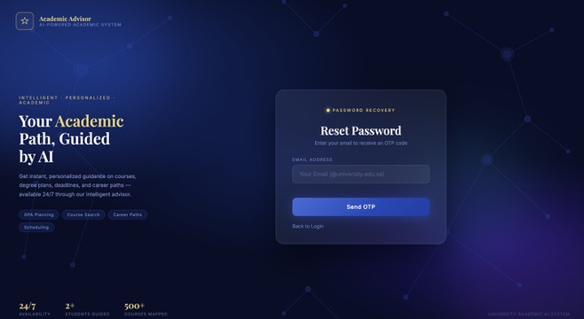
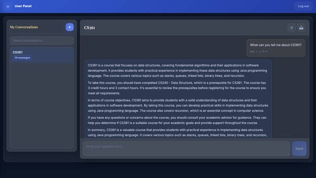
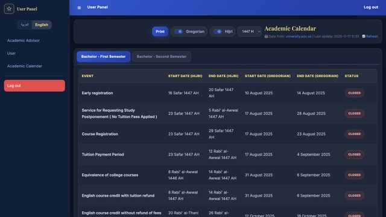
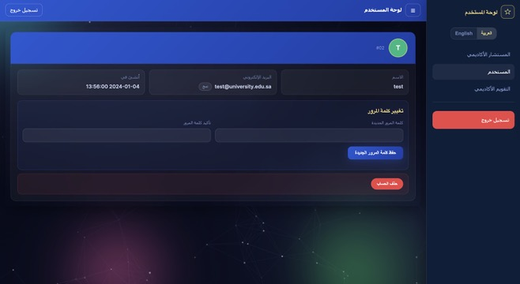

# Academic Advisor

An intelligent, bilingual (Arabic/English) AI-powered academic advising system built for university students. It provides personalized guidance on courses, degree plans, academic policies, and scheduling through a conversational interface grounded in official university data.

The project includes both the production advising system (React + FastAPI + RAG) and an earlier knowledge distillation training pipeline used to produce a specialized student model from a larger teacher model.

---

## Features

- **AI Academic Advisor** — Conversational AI grounded in university data including courses, prerequisites, academic policies, and regulations
- **RAG-Powered Responses** — Retrieval-Augmented Generation using sentence-transformers and vector search for answers grounded in official documents
- **Knowledge Distillation** — A training pipeline that distills a smaller, faster student model from a larger teacher model using a combined hard-label (cross-entropy) and soft-label (KL-divergence) objective
- **Bilingual Interface** — Full Arabic and English support with RTL layout, language-aware AI responses, and per-session locale switching
- **Secure Authentication** — JWT-based auth with university email domain enforcement, PBKDF2 password hashing, OTP email verification, and protected API routes
- **Academic Calendar** — Live calendar data scraped from the university website with Hijri/Gregorian date display, status badges, and print support
- **Conversation Management** — Persistent conversations with creation, search, text export, and deletion
- **User Management** — Profile viewing, password change, clipboard copy, and account deletion with confirmation
- **Responsive Design** — Glassmorphism UI with backdrop blur, animated backgrounds, and full mobile responsiveness

---

## Screenshots

### Authentication

<p align="center">
  
  <br><em>Login — Glassmorphism UI with animated background</em>
</p>

<p align="center">
  
  <br><em>Registration — University email domain enforcement with password strength validation</em>
</p>

<p align="center">
  
  <br><em>Email Verification — 6-digit OTP with expiry and resend</em>
</p>

<p align="center">
  
  <br><em>Password Recovery — OTP-based reset flow</em>
</p>

### Dashboard

<p align="center">
  
  <br><em>AI Advisor — Conversational interface restricted to academic queries</em>
</p>

<p align="center">
  
  <br><em>Academic Calendar — Live university data with Hijri/Gregorian dates and status tracking</em>
</p>

<p align="center">
  
  <br><em>User Profile — Account management with password change and deletion</em>
</p>

---

## Tech Stack

| Layer | Technology |
|-------|-----------|
| **Frontend** | React 19, React Router 7, Vite 6, DOMPurify |
| **Backend** | Python 3.10+, FastAPI, SQLAlchemy, Pydantic |
| **AI / NLP** | Sentence-Transformers, NumPy, RAG pipeline, LLM inference server |
| **Training** | PyTorch, Transformers, Knowledge Distillation (KL-div + CE), WandB |
| **Database** | MySQL (users, conversations, messages), SQLite (RAG knowledge base) |
| **Auth** | JWT (HMAC-SHA256), PBKDF2 password hashing, OTP verification |
| **Styling** | Custom CSS with CSS variables, glassmorphism, RTL support |
| **i18n** | JSON locale files (ar/en) with React context |

---

## Project Structure

```
academic-advisor/
├── frontend/                         # React SPA (Vite)
│   ├── index.html
│   ├── vite.config.js
│   ├── package.json
│   ├── eslint.config.js
│   └── src/
│       ├── main.jsx                  # App bootstrap (providers, router, error boundary)
│       ├── App.jsx                   # Route definitions with lazy loading
│       ├── api/
│       │   └── api.js                # API service layer
│       ├── context/
│       │   ├── AuthContext.jsx        # JWT auth state, login/logout/session
│       │   └── I18nContext.jsx        # Language state, RTL, translation
│       ├── components/
│       │   ├── AuthBackground.jsx     # Animated auth page background
│       │   ├── DashboardLayout.jsx    # Sidebar, topbar, language toggle
│       │   ├── ProtectedRoute.jsx     # Auth guard for dashboard routes
│       │   ├── ErrorBoundary.jsx      # Global error boundary
│       │   ├── UIModal.jsx            # Modal system (alert, confirm, prompt)
│       │   ├── ChatSidebar.jsx        # Conversation list with search
│       │   ├── ChatMessage.jsx        # Individual message bubble
│       │   └── ChatInput.jsx          # Message input with auto-resize
│       ├── pages/
│       │   ├── Login.jsx
│       │   ├── Register.jsx
│       │   ├── OtpVerify.jsx
│       │   ├── ForgotPassword.jsx
│       │   ├── ForgotPasswordVerify.jsx
│       │   ├── Chats.jsx              # Advisor UI (sidebar + messages + send/export)
│       │   ├── UserProfile.jsx
│       │   ├── Calendar.jsx
│       │   └── NotFound.jsx           # 404 page
│       ├── utils/
│       │   └── formatMessage.js       # Markdown-to-HTML with DOMPurify
│       ├── styles/
│       │   ├── auth-bg.css
│       │   ├── dashboard.css
│       │   ├── chat.css
│       │   ├── profile.css
│       │   └── calendar.css
│       └── locales/
│           ├── en.json
│           └── ar.json
│
├── backend/                          # Python FastAPI
│   ├── main.py                       # API server, conversation endpoints, AI integration
│   ├── auth_router.py                # Auth endpoints (register, login, OTP, reset, JWT)
│   ├── calendar_router.py            # Calendar scraping and caching
│   ├── ultimate_rag_system.py        # RAG engine (embeddings, retrieval, context generation)
│   ├── requirements.txt
│   └── .env.example
│
├── Old-Training-Approch/             # Knowledge Distillation Pipeline (earlier approach)
│   ├── configs/
│   │   ├── distill.yaml              # KD hyperparameters (temperature, alpha, lr, etc.)
│   │   └── eval.yaml                 # Evaluation thresholds and category definitions
│   ├── src/advisor/
│   │   ├── data/
│   │   │   ├── loader.py             # Fetch datasets from cloud URIs with local caching
│   │   │   ├── schema.py             # Pydantic validation for chat-format records
│   │   │   └── cleaner.py            # Fix legacy data issues that caused hallucinations
│   │   ├── distillation/
│   │   │   ├── losses.py             # KD loss: alpha * CE + (1-alpha) * T^2 * KL-div
│   │   │   └── trainer.py            # Training loop with teacher inference + student update
│   │   ├── evaluation/
│   │   │   ├── metrics.py            # Exact match, refusal accuracy, token F1
│   │   │   └── runner.py             # Generate predictions and compute metrics
│   │   └── serving/
│   │       └── app.py                # FastAPI inference endpoint
│   ├── scripts/                      # Shell scripts for pipeline stages
│   ├── docker/                       # Dockerfiles for training (GPU) and serving
│   ├── tests/                        # Unit tests (cleaner, losses, metrics, loader)
│   └── pyproject.toml                # Package config, dependencies, tool settings
│
├── database/
│   ├── university_reviews_schema_v2.sql
│   ├── university_reviews.sql
│   └── database_migration.sql
│
└── Screenshots/
```

---

## Knowledge Distillation (Training Pipeline)

The `Old-Training-Approch/` directory contains the earlier training pipeline used to produce a specialized academic advising model via knowledge distillation.

### Approach

A larger teacher model generates soft probability distributions over the vocabulary for each training example. A smaller student model is then trained to match both the teacher's soft-label distribution (via KL-divergence) and the ground-truth hard labels (via cross-entropy):

```
L = alpha_ce * CE(student, labels) + alpha_kd * T^2 * KL(student_soft || teacher_soft)
```

Where `T` is the distillation temperature (default 4.0), `alpha_ce` and `alpha_kd` independently weight the hard-label and soft-label objectives (both default to 0.5).

### Data Pipeline

Training data is curated Q&A pairs about courses, prerequisites, academic policies, and regulations. Before training, the data goes through automated cleaning:

| Issue | Fix |
|-------|-----|
| Malformed grammar from automated paraphrasing | Regex-based rewrites |
| Missing prerequisites encoded as `"is -."` | Normalized to `"has no prerequisite"` |
| Incorrect credit hours (ENG001/ENG002) | Corrected to 3 (verified against source) |
| Inconsistent punctuation | Normalized to single form |
| Exact duplicates from paraphrasing pipeline | Deduplicated |

### Evaluation

The evaluation dataset covers two categories:

- **Control** (91 pairs) — Factual lookups the model must answer correctly
- **Adversarial** (159 pairs) — Inputs the model must refuse (invented courses, fact mismatches, jailbreaks, cross-domain, vague prompts)

Metrics: exact match, refusal accuracy, and token-level F1. Pass/fail thresholds are defined in `configs/eval.yaml`.

### Running the Pipeline

```bash
cd Old-Training-Approch
pip install -e ".[dev]"

bash scripts/prepare_data.sh     # Fetch, validate, clean, cache
bash scripts/train.sh            # Run knowledge distillation
bash scripts/evaluate.sh         # Evaluate student model
bash scripts/serve.sh            # Launch inference API
```

---

## Installation

### Prerequisites

- **Node.js** 18+ and npm
- **Python** 3.10+
- **MySQL** 5.7+ (or MariaDB)
- **LLM Inference Server** — A local LLM server running on port `11434` (compatible with the `/api/chat` endpoint). Configure the model name in `backend/.env` via `LLM_MODEL`. The RAG system provides context grounding; the LLM server generates responses.

### 1. Clone the Repository

```bash
git clone https://github.com/R-Alothaim/AI-powered-Academic-Advising-System.git
cd AI-powered-Academic-Advising-System
```

### 2. Database Setup

```bash
mysql -u root -e "CREATE DATABASE IF NOT EXISTS university_reviews;"
mysql -u root university_reviews < database/university_reviews_schema_v2.sql
```

> Add `-p` if your MySQL user requires a password.

### 3. Backend Setup

```bash
cd backend
python -m venv .venv
source .venv/bin/activate
pip install -r requirements.txt
cp .env.example .env
```

Edit `.env` with your configuration:

```ini
MYSQL_UNIX_SOCKET=/tmp/mysql.sock
JWT_SECRET=your-secret-key-here
CORS_ORIGINS=http://localhost:3000
LLM_MODEL=your-model-name:latest
```

### 4. Frontend Setup

```bash
cd frontend
npm install
```

### 5. Start the Application

**Terminal 1** — Backend:
```bash
cd backend && source .venv/bin/activate && python main.py
```

**Terminal 2** — Frontend:
```bash
cd frontend && npm run dev
```

Open `http://localhost:3000`.

---

## API Reference

### Authentication

| Method | Endpoint | Description |
|--------|----------|-------------|
| `POST` | `/auth/register` | Create account |
| `POST` | `/auth/login` | Authenticate and receive JWT |
| `POST` | `/auth/verify-otp` | Verify email with OTP |
| `POST` | `/auth/resend-otp` | Resend OTP |
| `POST` | `/auth/forgot-password` | Request password reset |
| `POST` | `/auth/reset-password` | Verify OTP and reset password |
| `GET` | `/auth/me` | Get current user from JWT |

### Conversations

| Method | Endpoint | Description |
|--------|----------|-------------|
| `GET` | `/users/{id}/chats` | List conversations |
| `POST` | `/chats` | Create conversation |
| `GET` | `/chats/{id}` | Get conversation with messages |
| `GET` | `/chats/{id}/messages` | Get messages only |
| `POST` | `/chats/{id}/message` | Send message and receive AI response |
| `POST` | `/chats/delete` | Delete conversation |
| `DELETE` | `/chats/{id}` | Delete conversation (REST) |

### Users

| Method | Endpoint | Description |
|--------|----------|-------------|
| `GET` | `/users/{id}` | Get profile (authenticated) |
| `POST` | `/users/{id}/change-password` | Change password (authenticated) |
| `DELETE` | `/users/{id}` | Delete account (authenticated) |

### System

| Method | Endpoint | Description |
|--------|----------|-------------|
| `GET` | `/calendar?year=1447&lang=ar` | Academic calendar data |
| `GET` | `/health` | System health check |
| `GET` | `/stats` | Statistics |

---

## Architecture

```
                    ┌─────────────────────────────────┐
                    │         React Frontend           │
                    │       (Vite dev server :3000)    │
                    │                                  │
                    │  Auth Context ─ I18n Context     │
                    │  Protected Routes ─ UI Modals    │
                    │  Pages: Login, Advisor, Calendar │
                    └──────────┬──────────────────────┘
                               │ /api proxy
                    ┌──────────▼──────────────────────┐
                    │        FastAPI Backend            │
                    │        (uvicorn :8000)            │
                    │                                  │
                    │  auth_router ── JWT + OTP         │
                    │  calendar_router ── Web scraping  │
                    │  main ── Conversations + RAG      │
                    └────┬──────────┬─────────────────┘
                         │          │
                  ┌──────▼───┐ ┌───▼──────────────┐
                  │  MySQL   │ │  RAG System       │
                  │  users   │ │  Embeddings       │
                  │  chats   │ │  Vector Search    │
                  │  messages│ │  Context Grounding│
                  └──────────┘ └───────┬──────────┘
                                       │
                                ┌──────▼──────┐
                                │ LLM Server  │
                                │   :11434    │
                                └─────────────┘
```

---

## Security

| Measure | Implementation |
|---------|---------------|
| **Authentication** | JWT (HMAC-SHA256), 24-hour expiry |
| **Password Hashing** | PBKDF2-SHA256, 100K iterations, random salt |
| **Email Verification** | 6-digit OTP, hashed storage, 10-minute expiry |
| **Authorization** | Ownership verification on user-scoped endpoints |
| **Input Validation** | University email domain whitelist, password strength enforcement |
| **XSS Prevention** | DOMPurify sanitization on rendered HTML |
| **SQL Injection** | SQLAlchemy ORM with parameterized queries |
| **CORS** | Configurable allowed origins via environment variable |

---

## License

This project is for educational and research purposes. All rights reserved.
